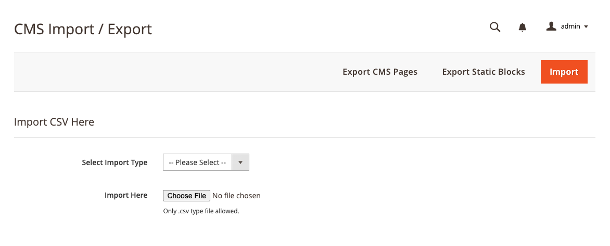

<strong>Mdbhojwani_CmsImporter</strong> 

## Table of contents

- [Summary](#summary)
- [Installation](#installation)
- [Configurations](#configurations)
- [License](#license)

## Summary

Module is used to import or export CMS Blocks and Pages.

## Installation

```
composer require mdbhojwani/magento2-cms-importer
bin/magento module:enable Mdbhojwani_CmsImporter
bin/magento setup:upgrade
bin/magento setup:di:compile
bin/magento setup:static-content:deploy -f
bin/magento cache:clean
bin/magento cache:flush
```

## Configurations

```
1. Login to Magento Backend
2. Navigate to Content > Elements > Import/Export
```



## License

[Open Software License ("OSL") v. 3.0](https://opensource.org/license/osl-3-0-php)
